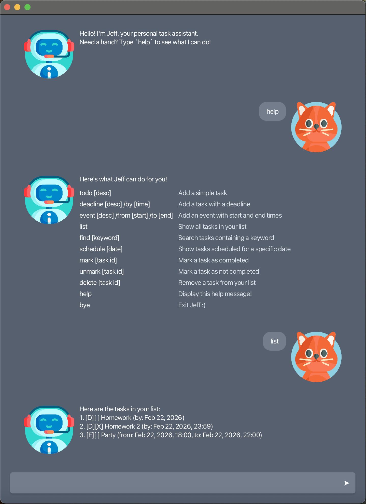
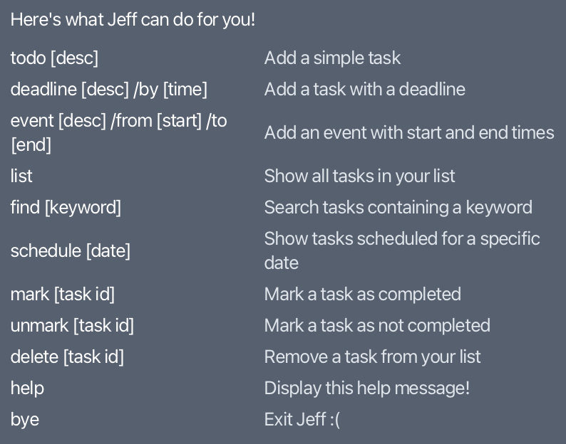

# Jeff User Guide



Welcome to **Jeff**, your personal task assistant! 
Jeff helps you manage tasks, deadlines, and events efficiently through simple commands.
This guide explains all the commands Jeff supports and shows Commands of their usage.

---

## 📝 Adding ToDos

Adds a simple task to your list.

**Command:**
```text
todo Buy groceries
```

**Expected outcome:**
```text
Ok, I've added a ToDo task:
[T][ ] Buy groceries
There are 1 task(s) in the list.
```

---

## ⏰ Adding Deadlines

Adds a task with a specific deadline.

**Command:**
```text
deadline Submit report /by 2026-03-01T17:00
```

**Expected outcome:**
```text
Ok, I've added a Deadline task:
[D][ ] Submit report (by: Mar 01, 2026, 17:00)
There are 2 task(s) in the list.
```

---

## 📅 Adding Events

Adds an event with start and end times.

**Command:**
```text
event Team meeting /from 2026-02-25T14:00 /to 2026-02-25T15:30
```

**Expected outcome:**
```text
Ok, I've added an Event task:
[E][ ] Team meeting (from: Feb 25, 2026, 14:00, to: Feb 25, 2026, 15:30)
There are 3 task(s) in the list.
```

---

## 📋 Viewing All Tasks

Displays all tasks stored in your list.

**Command:**
```text
list
```

**Expected outcome:**
```text
Here are the tasks in your list:
1. [T][ ] Buy groceries
2. [D][ ] Submit report (by: Mar 01, 2026, 17:00)
3. [E][ ] Team meeting (from: Feb 25, 2026, 14:00, to: Feb 25, 2026, 15:30)
```

---

## 🔍 Searching Tasks

Finds tasks containing a keyword in their description.

**Command:**
```text
find report
```

**Expected outcome:**
```text
Here are the matching tasks in your list:
1. [D][ ] Submit report (by: Mar 01, 2026, 17:00)
```

---

## 📆 Viewing Schedule

Displays tasks scheduled for a specific date.

**Command:**
```text
schedule 2026-02-25
```

**Expected outcome:**
```text
Here's your schedule for Feb 25, 2026:
1. [E][ ] Team meeting (from: Feb 25, 2026, 14:00, to: Feb 25, 2026, 15:30)
```

---

## ✅ Marking Tasks as Done

Marks a task as completed.

**Command:**
```text
mark 2
```

**Expected outcome:**
```text
Ok, I've marked this task as done:
[D][X] Submit report (by: Mar 01, 2026, 17:00)
```

---

## ❌ Unmarking Tasks

Marks a task as not completed.

**Command:**
```text
unmark 2
```

**Expected outcome:**
```text
Ok, I've marked this task as not done:
[D][ ] Submit report (by: Mar 01, 2026, 17:00)
```

---

## 🗑 Deleting Tasks

Removes a task from your list.

**Command:**
```text
delete 1
```

**Expected outcome:**
```text
Ok, I've removed this task:
[T][ ] Buy groceries
There are 2 task(s) in the list.
```

---

## ❓ Help

Displays all available commands and their usage.

**Command:**
```text
help
```

**Expected outcome:**



---

## 🚪 Exiting Jeff

Ends the application safely.

**Command:**
```text
bye
```

**Expected outcome:**
```text
Bye. Hope to see you again soon!
Jeff will close automatically in 5 seconds...
```
